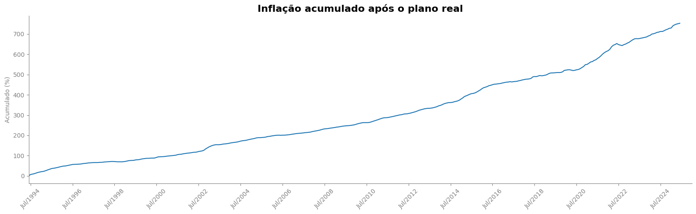
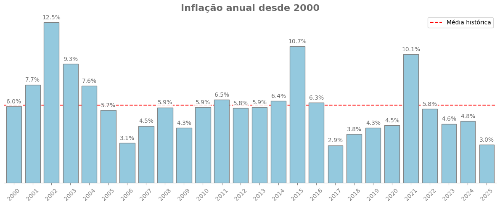

# 📈 Análise Histórica da Inflação Brasileira (1980–2025)

Este projeto tem como objetivo analisar a evolução da inflação anual no Brasil desde o ano 1980, utilizando dados históricos e visualizações gráficas para identificar padrões, médias e tendências relevantes.

Os dados utilizado foram coletados do Sitema de Séries Temporais do Banco do Brasil, utilizando o pyhton.

veja a análise completa aqui: [01_analise_inflacao.ipynb](https://nbviewer.org/github/MarcianoFerreira/analises-macroeconomicas/blob/main/01_analise_inflacao.ipynb)

## 🔍 Principais Resultados
1. A trajetória da inflação no Brasil, desde a década de 1980, revela dois momentos bastante distintos, o que pode ser visto no gráfico baixo:

2. Desde a implementação do Plano Real, em julho de 1994, a inflação acumulada no Brasil atingiu aproximadamente 753% até 2025.

3. R$1,00 em 2000 teria um poder de compra equivalente a R$4,60 em 2025.  A taxa média de crescimento anual - composto - da inflação nesse período foi de aproximadamente 6,29%.

4. Embora a inflação brasileira não tenha retornado aos níveis críticos observados na década de 1990, ela permaneceu presente de forma consistente ao longo dos anos.

## 📌 Conclusão

A análise evidencia a persistência da inflação ao longo das últimas décadas e ressalta a importância do controle inflacionário. O conhecimento dessas dinâmicas é essencial para decisões financeiras pessoais e políticas públicas eficazes.

---

## 🛠️ Tecnologias Utilizadas

- Python (pandas, matplotlib)